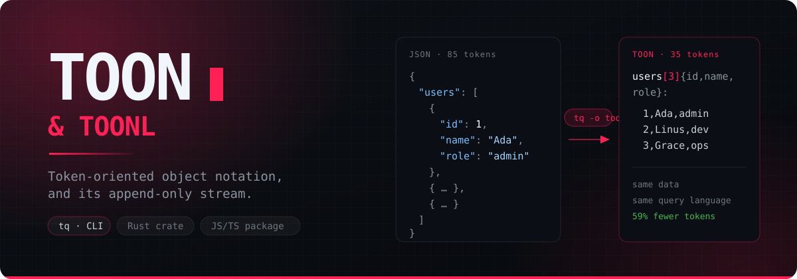
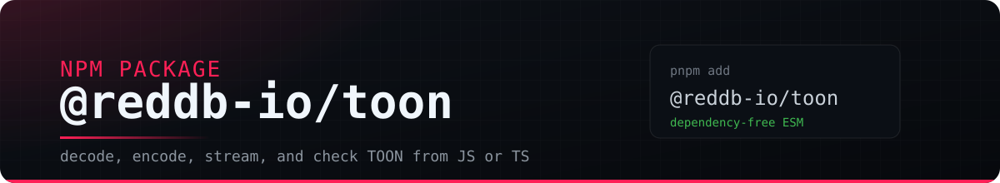
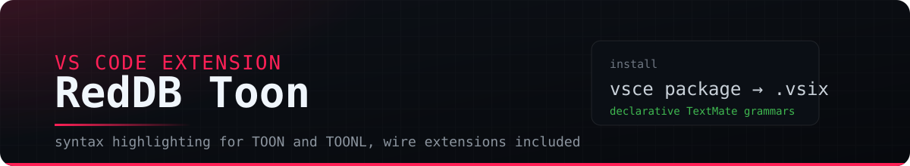

<div align="center">



[](https://github.com/reddb-io/toon/releases)
[](https://github.com/reddb-io/toon/actions/workflows/ci.yml)
[](LICENSE)
[](#prebuilt-binaries)

</div>

---

## Repository map

This repository has grown from a format implementation into a complete TOON
toolkit. Use this map to find each user-facing area; links point to the relevant
documentation or source directory, depending on the component's maturity.

| Area | What is here |
| --- | --- |
| **Formats and specifications** | The pinned [official TOON v4.1.1 baseline](docs/toon-official-spec.md), [RedDB opt-in extensions](docs/toon-reddb-spec.md), and the [TOONL streaming specification](docs/toonl-reddb-spec.md). |
| **Codec libraries and streaming** | The [`@reddb-io/toon`](packages/toon) package and [`reddb-io-toon`](crates/toon) crate: codecs, event streams, truncation reports, TOONL readers/writers, and JSON bridges. See [What ships](#what-ships). |
| **RPC family** | The draft [TOON-RPC protocol](docs/toon-rpc-spec.md), published libraries, experimental transports, JSON-RPC/TOON-RPC negotiation, MCP/ACP adapters, prototype code generation and CLI tooling, and examples. Kept together under [RPC family](#rpc-family). |
| **Command-line tools** | The drop-in `toon` converter and the [`tq`](crates/tq) query/conversion CLI for TOON, TOONL, JSON, YAML, and XML, with its [language reference](docs/tq-language.md) and [jq parity record](docs/tq-jq-parity.md). |
| **Editor integration** | The [RedDB Toon VS Code extension](packages/vscode-toon) for `.toon`, `.toonl`, and fenced Markdown blocks. |
| **Benchmarks and evidence** | Reproducible [accuracy, token-efficiency, and runtime benchmarks](benchmarks/), shared [conformance, parity, golden, and adversarial test corpora](tests/), and pinned [specification](vendor/toon-spec) and [reference implementation](vendor/toon) checkpoints. |
| **Examples** | [RPC clients and servers](crates/reddb-io-toon-rpc-examples), [codec examples](crates/toon/examples), and [editor grammar samples](packages/vscode-toon/examples). |
| **Design and migration records** | The [v4.1 migration guide](docs/migration-v4.md), [design-history proposals](docs/proposals/), [upstream monitoring](docs/upstream-monitoring.md), and [feedback ledger](docs/upstream-feedback.md). |
| **Install, releases, and development** | [Prebuilt binaries](#prebuilt-binaries), the [`install.sh`](install.sh) installer, [release history](CHANGELOG.md), [GitHub releases](https://github.com/reddb-io/toon/releases), and the [development workflow](#develop). |

---

## Original project and our laboratory

TOON was created by [Johann Schopplich](https://github.com/johannschopplich). The [official toon-format project](https://github.com/toon-format/toon) and [toonformat.dev](https://toonformat.dev) are the normative authorities for the format.

This repository is [RedDB](https://reddb.io)'s practical laboratory. It follows the official format while exploring and shipping the libraries, command-line tools, streaming support, and opt-in extensions needed by RedDB's own production workflows. It is not the original project and is not endorsed by upstream.

---

## Formats

TOON is a token-oriented object notation for carrying structured JSON-shaped data through prompts and pipelines with less syntax overhead. It keeps the JSON data model, adds length-bearing tabular forms, and makes common truncation failures visible to decoders.

TOONL is the append-only stream form: one record per line, header once, and optional trailers for closed-stream verification. It is the streaming layer used by the JS package, Rust crate, and `tq`.

The root README is a hub, not the normative spec. Use these documents for detail:

This repository pins the official **TOON v4.1.1** specification as its baseline
and layers a set of opt-in extensions on top of it.

- [Official TOON baseline](docs/toon-official-spec.md): the pinned upstream release, API boundaries, frontier status, and executable evidence.
- [RedDB TOON extensions](docs/toon-reddb-spec.md): userland features layered on v4.1, with each decode/encode opt-in and fallback rule stated explicitly.
- [TOONL RedDB spec](docs/toonl-reddb-spec.md): append-only stream grammar and reader/writer behavior.
- [v4.1 migration notes](docs/migration-v4.md): TypeScript and Rust cutovers from the retired pre-v4 baseline, with observable before/after behavior.
- [Design-history proposals](docs/proposals/): the design history behind each extension — including the mechanisms the official spec absorbed at v4.1.

---

## Command-line tools

- **`toon`** is the drop-in converter. Its TypeScript and Rust front ends are compatible with the pinned upstream v4.1.1 package and CLI contract.
- **`tq`** is the advanced jq-style query and transformation tool. It reads TOON, JSON, YAML, XML, and TOONL and can emit TOON, JSON, XML, or TOONL.

## Verified compatibility

Compatibility here is deliberately scoped and executable. The `toon` implementations pass the vendored upstream package and CLI compatibility gates, share byte-for-byte JavaScript/Rust CLI goldens, and are checked for Rust↔TypeScript encoder parity against the pinned v4.1.1 baseline. See the [pinned compatibility record](docs/toon-official-spec.md) and [options inventory](docs/options-parity-v4.1.1.md).

`tq` does **not** claim universal jq equivalence. Its relationship to jq 1.7.1 is verified by a vendored parity corpus, a documented [divergence ledger](docs/tq-jq-parity.md#divergence-ledger), and [`tq jq-check`](docs/tq-jq-parity.md#the-compatibility-decision), which emits a machine-readable compatibility classification for a particular filter and option set.

---

## What ships



### `@reddb-io/toon` — JS/TS package

Dependency-free ESM for applications that need TOON in JavaScript, TypeScript, Node, Bun, Deno, or browsers. It parses TOON into plain JSON-shaped values, serializes those values back to canonical TOON, detects common truncation failures before a partial model response is trusted, and includes TOONL helpers for append-only record streams.

Use it when a prompt or pipeline wants compact structured data but the application still needs normal JSON objects at the edges.

```bash
pnpm add @reddb-io/toon
```

```js
import { decode, encode } from '@reddb-io/toon'

const document = decode('users[2]{id,name}:\n  1,Ada\n  2,Linus\n')
console.log(document.users[0].name)
process.stdout.write(`${encode(document)}\n`)
```
```console
Ada
```
```console
users[2]{id,name}:
  1,Ada
  2,Linus
```

```js
import { encodeRecords, parseRecords } from '@reddb-io/toon'

const stream = encodeRecords([
  { id: 1, name: 'Ada' },
  { id: 2, name: 'Linus' },
])

process.stdout.write(stream)
console.log(JSON.stringify(parseRecords(stream)))
```
```console
[]{id,name}:
1,Ada
2,Linus
[=2]
```
```console
[{"id":1,"name":"Ada"},{"id":2,"name":"Linus"}]
```

Check completeness before accepting generated or streamed data:

```js
import { detectTruncation } from '@reddb-io/toon'

const report = detectTruncation('items[2]:\n  - one\n')
console.log(report.complete)
console.log(report.kind)
```
```console
false
```
```console
array_length_mismatch
```

Details: [`packages/toon`](packages/toon), [TOON spec companion](docs/toon-official-spec.md), [RedDB TOON extensions](docs/toon-reddb-spec.md), [TOONL spec](docs/toonl-reddb-spec.md), and the [truncation report model](docs/proposals/detect-truncation.md).

### RPC family

TOON-RPC is a draft transport-independent protocol with JSON-RPC semantics and
TOON serialization. Its protocol, packages, transports, adapters, tooling, and
examples stay together here even though they span npm and crates.io. This is an
inventory, not a uniform stability claim: published libraries coexist with
experimental transports and prototype tooling.

| Surface | Contents |
| --- | --- |
| Protocol | [TOON-RPC specification](docs/toon-rpc-spec.md) and JSON-RPC/TOON-RPC wire negotiation |
| TypeScript | [`@reddb-io/toon-rpc`](packages/toon-rpc) client/server, [`@reddb-io/multi-rpc`](packages/multi-rpc) multi-protocol dispatcher, [`@reddb-io/toon-rpc-mcp`](packages/toon-rpc-mcp), and [`@reddb-io/toon-rpc-acp`](packages/toon-rpc-acp) |
| Rust core and transports | [`reddb-io-toon-rpc`](crates/reddb-io-toon-rpc), [stdio](crates/reddb-io-toon-rpc-stdio), [HTTP](crates/reddb-io-toon-rpc-http), experimental [SSE](crates/reddb-io-toon-rpc-sse), [TCP](crates/reddb-io-toon-rpc-tcp), [WebSocket](crates/reddb-io-toon-rpc-ws), and [long polling](crates/reddb-io-toon-rpc-longpolling) |
| Tooling and adapters | Prototype [IDL code generation](crates/reddb-io-toon-rpc-codegen) and [RPC CLI](crates/reddb-io-toon-rpc-cli), plus [MCP](crates/reddb-io-toon-rpc-mcp), [ACP](crates/reddb-io-toon-rpc-acp), and [end-to-end examples](crates/reddb-io-toon-rpc-examples) |

Install `@reddb-io/multi-rpc` directly when one endpoint must answer both wire
formats:

```bash
pnpm add @reddb-io/multi-rpc
```

```js
import { MultiRpc, Server } from '@reddb-io/multi-rpc'

const server = new Server()
server.register('echo', async (params) => params)

const rpc = new MultiRpc(server)
const response = await rpc.handle(
  '{"jsonrpc":"2.0","method":"echo","params":{"name":"Ada"},"id":1}',
)
```

`MultiRpc` is owned and exported only by `@reddb-io/multi-rpc`; it is not a
subpath of `@reddb-io/toon-rpc`.


### `reddb-io-toon` — Rust crate

The Rust library behind the CLIs and a standalone crate for services that want TOON without shelling out. It provides the parser, serializer, ordered document model, event decoder, truncation detector, JSON bridges, and TOONL reader/writer utilities used by `toon` and `tq`.

Use it for Rust pipelines that need canonical TOON output, bounded parsing for untrusted input, or append-only TOONL streams that can be checked and resumed.

```bash
cargo add reddb-io-toon
```

```rust
use reddb_io_toon::Value;

fn main() -> Result<(), Box<dyn std::error::Error>> {
    let document = Value::parse_toon("users[2]{id,name}:\n  1,Ada\n  2,Linus\n")?;
    println!("{}", document.to_canonical_toon());
    Ok(())
}
```

Detect a truncated TOON document without losing the structured reason:

```rust
use reddb_io_toon::detect_truncation;

fn main() {
    let report = detect_truncation("items[2]:\n  - one\n");
    assert!(!report.complete);
    assert_eq!(report.to_json_value()["kind"], "array_length_mismatch");
}
```

Write and read a small TOONL stream:

```rust
use reddb_io_toon::{encode_toonl_values, ToonlReader, Value};
use std::io::Cursor;

fn main() -> Result<(), Box<dyn std::error::Error>> {
    let rows = vec![
        Value::from_json_str(r#"{"id":1,"name":"Ada"}"#)?,
        Value::from_json_str(r#"{"id":2,"name":"Linus"}"#)?,
    ];
    let stream = encode_toonl_values(&rows)?;
    let decoded = ToonlReader::new(Cursor::new(stream.as_bytes()))
        .collect::<Result<Vec<_>, _>>()?;
    assert_eq!(decoded, rows);
    Ok(())
}
```

Details: [`crates/toon`](crates/toon), [decoder and encoder options](docs/toon-official-spec.md), [RedDB extension rules](docs/toon-reddb-spec.md), [TOONL streaming format](docs/toonl-reddb-spec.md), and the [truncation report model](docs/proposals/detect-truncation.md).


### `tq` — CLI

An advanced jq-style command-line tool for querying and transforming data at the terminal. It queries TOON, JSON, YAML, XML, and TOONL rows; converts between TOON, TOONL, JSON, and XML; checks TOON or TOONL for truncation; and closes or trims append-only streams.

The shipped language includes `def` functions with closures and bounded recursion, paths and recursive descent, assignments, string interpolation and `@formats` such as `@json` and `@csv`, and `--arg`/`--argjson` bindings. The [language catalog](docs/tq-language.md) marks every builtin as supported, deferred, or never; the jq parity record above documents the precise compatibility boundary.

Use it in shell pipelines to query a model response, turn JSON/YAML into compact TOON for a prompt, convert record streams to TOONL, or verify that a stream ended cleanly.

```bash
curl -fsSL https://raw.githubusercontent.com/reddb-io/toon/main/install.sh | sh
```

```bash
printf 'users[2]{id,name}:\n  1,Ada\n  2,Linus\n' \
  | tq '.users[].name'
```

Convert JSON records into TOONL for append-only logs:

```bash
printf '{"id":1,"name":"Ada"}\n{"id":2,"name":"Linus"}\n' \
  | tq -p json -o toonl .
```

Query YAML input and emit compact JSON:

```bash
printf 'users:\n  - id: 1\n    name: Ada\n' \
  | tq -p yaml -o json -c '.users[0]'
```

Check truncation before piping a partial document onward:

```bash
if ! printf 'items[2]:\n  - one\n' | tq check -p toon; then
  echo 'truncated input'
fi
```

Update in place — `tq upgrade` resolves the latest release, verifies the download against the release checksums, and replaces its own binary. `--check` only reports, exiting non-zero when an update is waiting, so it fits in a script:

```bash
tq upgrade            # no-op when already current
tq upgrade --check    # exit 0 up to date, exit 1 update available
tq upgrade X.Y.Z      # pin a version
```

It honours the same knobs as the installer: `TQ_CHANNEL` (`stable`/`next`), `TQ_VERSION` (a pin, which the positional argument overrides), and `GITHUB_TOKEN`. Upgrading needs write permission on the directory holding the binary; without it, `tq` says so and points at the installer. On Windows a running `tq.exe` cannot be overwritten, so upgrade renames it aside before writing the new one and cleans the leftover up on the next run.

Source install:

```bash
cargo install reddb-io-tq
```

Details: [`crates/tq`](crates/tq), [release assets](https://github.com/reddb-io/toon/releases), [TOON format detail](docs/toon-official-spec.md), [RedDB TOON extensions](docs/toon-reddb-spec.md), [TOONL streaming format](docs/toonl-reddb-spec.md), and [development commands](#develop).



### RedDB Toon — VS Code extension

Declarative syntax highlighting for `.toon` and `.toonl` files, plus `toon`/`toonl` fenced code blocks in Markdown. The TextMate grammars cover TOON v4.1 with the RedDB wire extensions, and TOONL v0.1/v0.2 including trailers, continuation headers, named schemas, and tagged rows. Escape mistakes and the reserved TOONL `- ` prefix show up as errors while you type.

Use it when reading or writing TOON documents, TOONL streams, or the spec documents in [`docs/`](docs/) inside VS Code.

Every stable release includes the `.vsix` as a release asset:

```bash
curl -fsSL https://github.com/reddb-io/toon/releases/latest/download/reddb-toon.vsix -o /tmp/reddb-toon.vsix && code --install-extension /tmp/reddb-toon.vsix
```

One-liner from a clone:

```bash
(cd packages/vscode-toon && pnpm dlx @vscode/vsce package -o reddb-toon.vsix) && code --install-extension packages/vscode-toon/reddb-toon.vsix
```

VSCodium and Cursor users: swap `code` for `codium` / `cursor`. Once the extension is listed on the Marketplace and Open VSX (planned), the in-editor one-liner becomes `Ctrl+P` → `ext install reddb-io.reddb-toon`.

Or open `packages/vscode-toon` in VS Code and press `F5` to try the grammars in an Extension Development Host against `examples/sample.toon` and `examples/sample.toonl`.

Details: [`packages/vscode-toon`](packages/vscode-toon), [TOON spec companion](docs/toon-official-spec.md), [RedDB TOON extensions](docs/toon-reddb-spec.md), and [TOONL streaming format](docs/toonl-reddb-spec.md).

---

## Prebuilt binaries

Each release publishes `tq` binaries for Linux, macOS, and Windows, plus checksums and build provenance. The installer script resolves the matching asset for the current platform and installs or updates `tq` in place.

```bash
curl -fsSL https://raw.githubusercontent.com/reddb-io/toon/main/install.sh | sh
```

An installed `tq` updates itself with [`tq upgrade`](#tq--cli), which resolves and verifies the same assets.

Useful installer knobs:

| Variable | Effect |
| --- | --- |
| `TQ_VERSION` | Pin a release tag |
| `TQ_CHANNEL` | Use `stable` or `next` |
| `TQ_INSTALL_DIR` | Choose the installation directory |
| `TQ_FORCE` | Reinstall even when already current |

---

## Develop

```bash
git clone https://github.com/reddb-io/toon
cd toon
git submodule update --init

cargo test --workspace
cargo run -p reddb-io-tq -- . deploys.toon

corepack enable
pnpm install
pnpm -r test
```

The Rust and pnpm workspaces include the format, CLI, RPC, MCP, ACP, and editor
packages shown above. Release automation keeps every published crate, npm
package, and the extension on the same version.

`Auto release` is the controller for pushes to `main`: it derives the stable
SemVer bump from conventional commits, synchronizes every manifest, creates the
release commit, and dispatches the exact SHA. `Release` is the executor: it
builds platform assets, publishes registries, creates the GitHub Release, and
verifies clean consumers. It can also be dispatched manually for a `next`
prerelease or to retry a stable release; normal pushes do not run both workflows
independently.

## License

[MIT](LICENSE).
